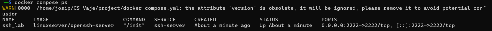
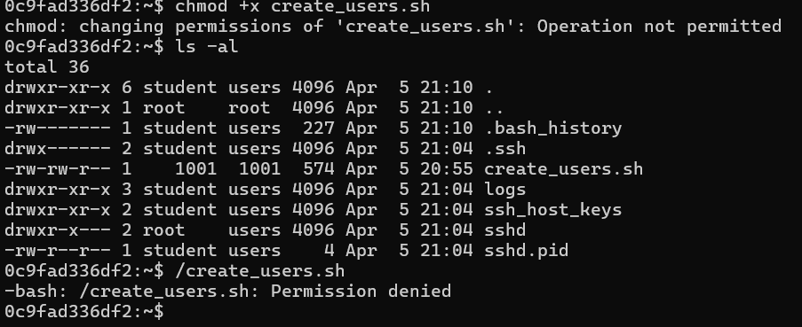
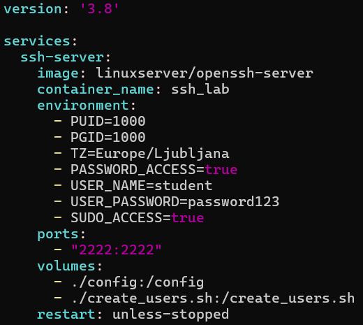
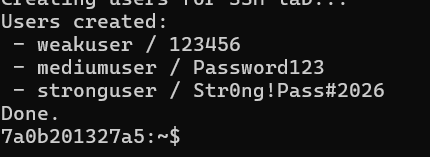
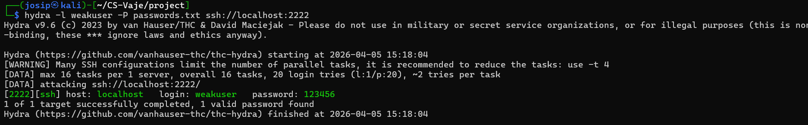
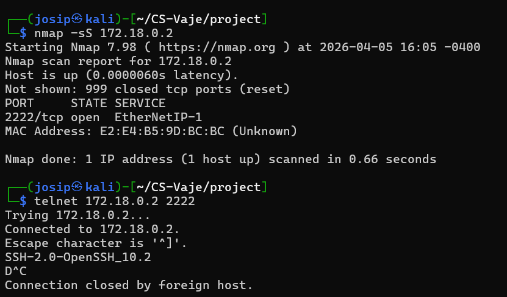
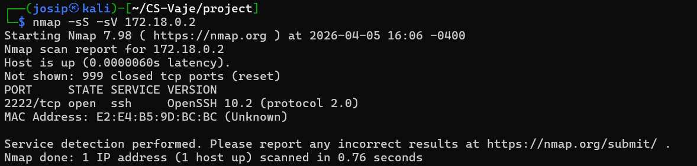
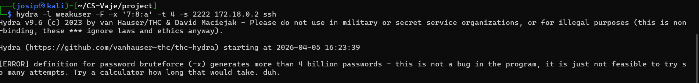
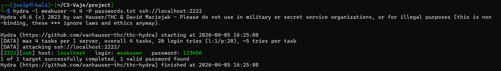
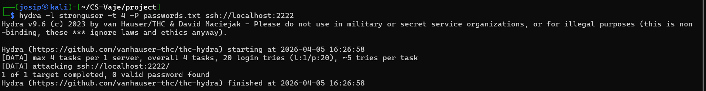

# 🛡️ Empirical Project: SSH Security Weakness Study

## 📌 Overview

In this project, you will perform an empirical analysis of SSH security by simulating brute-force attacks under different configurations.

The goal is to understand how password strength and defensive mechanisms affect the resistance of an SSH service against automated attacks.

---

## 🐳 Lab Setup (Docker)

This lab uses a preconfigured SSH server running inside Docker.

### 1. Start the environment

```bash
docker compose up -d
```

---

### 2. Connect to the SSH server

```bash
ssh student@localhost -p 2222
```

Default credentials:
- Username: `student`
- Password: `password123`

---

### ⚠️ SSH Warning (IMPORTANT)

If you see the following warning:

```
WARNING: REMOTE HOST IDENTIFICATION HAS CHANGED!
```

This is expected when restarting Docker containers.

Fix it with:

```bash
ssh-keygen -R "[localhost]:2222"
```

Then reconnect.

---

### 3. Add additional users (for experiments)

If the create_users.sh script is not present in docker you can copy the script into the container:

```bash
docker cp create_users.sh ssh_lab:/create_users.sh
```

Run it:

```bash
docker exec -it ssh_lab bash
chmod +x /create_users.sh
/create_users.sh
```


There is an issue with the Docker image, it does not work. Added my user to sudo.


This will create:

| User | Password | Purpose |
|------|---------|--------|
| weakuser | 123456 | Easy to crack |
| mediumuser | Password123 | Moderate |
| stronguser | Str0ng!Pass#2026 | Hard to crack |


---

### 4. Run brute-force attack

Example using Hydra:

```bash
hydra -l weakuser -P passwords.txt ssh://localhost:2222
```

---

### ⚠️ Important

- Perform attacks **only on this local environment**
- Do NOT target real systems

---

## 🎯 Objectives

- Understand how SSH authentication can be attacked using brute-force techniques  
- Evaluate the impact of password strength on attack success  
- Analyze defensive mechanisms such as rate limiting  
- Collect and interpret empirical data  

---

## 🧪 Scenario

You are a security analyst tasked with evaluating the resilience of an SSH server.
The organization suspects that weak credentials and poor configuration may expose the system to brute-force attacks.
Your job is to test different configurations and provide evidence-based recommendations.

---

## 🛠️ Tools

- `nmap` – scanning  
- `hydra` – brute-force  
- Linux (Ubuntu/Kali recommended)  

Optional:
- Python / Excel  

---

## ⚙️ Experimental Setup

Test at least **3 configurations**:

- Weak password, no protection  
- Strong password, no protection  
- Strong password + rate limiting (e.g., fail2ban)  

---

## 🔍 Tasks

### 1. Reconnaissance
- Identify SSH service using `nmap`




### 2. Brute-force attack
- Execute attack using `hydra`
- Record:
  - success
  - time
  - attempts

Attempting regular brute force fails. I will password list and examples from the lab.


#### weak

#### strong

Password is not in the word list. Of course we failed. 

Based on the research "Adding Salt to Pepper - A Structured Security Assessment over a Humanoid Robot" Hydra supports up to 64 threads. They measured speed of almost a 1000 passwords per minute.

Str0ng!Pass#2026 is 16 characters long.

The general formula for a password of length n using an alphabet of size c is 
```
combinations = c^n
```
For n = 16, it depends on which character set is used:

| Character set | Size (c) | Combinations (c^16) |
|---|---|---|
| Lowercase only (a-z) | 26 | 26^16 ≈ 4.3 × 10^22 |
| Lower + Upper (a-zA-Z) | 52 | 52^16 ≈ 5.2 × 10^27 |
| Alphanumeric (a-zA-Z0-9) | 62 | 62^16 ≈ 4.7 × 10^28 |
| + Special chars (~95 printable ASCII) | 95 | 95^16 ≈ 4.4 × 10^31 |

For Str0ng!Pass#2026 specifically — it uses uppercase, lowercase, digits, and special chars, so c = 95.

```
95^16 ≈ 4.4 × 10^31 combinations
```

To calculate time taken:
years = c^n / (attempts_per_second × 31,557,600)
Where 31,557,600 = seconds in a year (365.25 × 24 × 3600).

This is the worst-case (full exhaustion). On average, the correct password is found halfway through, so divide by 2


| Character set (c) | Combinations | 10/s | 100/s | 1,000/s | 1,000,000/s |
|---|---|---|---|---|---|
| Lowercase (26) | 4.36 × 10^22 | 1.38 × 10^14 yrs | 1.38 × 10^13 yrs | 1.38 × 10^12 yrs | 1.38 × 10^9 yrs |
| Mixed case (52) | 2.86 × 10^27 | 9.06 × 10^18 yrs | 9.06 × 10^17 yrs | 9.06 × 10^16 yrs | 9.06 × 10^13 yrs |
| Alphanumeric (62) | 4.76 × 10^28 | 1.51 × 10^20 yrs | 1.51 × 10^19 yrs | 1.51 × 10^18 yrs | 1.51 × 10^15 yrs |
| Full ASCII (95) | 4.40 × 10^31 | 1.39 × 10^23 yrs | 1.39 × 10^22 yrs | 1.39 × 10^21 yrs | 1.39 × 10^18 yrs |

It would take longer than the universe exists.

#### strong + fail2ban

Fail2ban can not be added to existing container as there is nothing to run services.
```
bash
apk add fail2ban
cp /etc/fail2ban/jail.conf jail.local
```

### 3. Data collection

| Config | Password | Protection | Success | Time | Attempts |
|--------|----------|------------|---------|------|----------|
| weak | 123456 | none | True | instant | 20 |
| strong | Str0ng!Pass#2026 | none | False | Time | Attempts |
| strong | Str0ng!Pass#2026 | fail2ban | UNKNOWN | Time | Attempts |

---

### 4. Analysis

- Impact of password strength  
- Effectiveness of protections  
- Security vs usability trade-off  
- Explain how fail2ban would affect your results.
- Would it prevent brute-force attacks completely?
- How could an attacker bypass it?

---

### 5. Recommendations

Provide at least 3 improvements.

---

## 📊 Deliverables

Report (5–10 pages):

1. Introduction  
2. Methodology  
3. Experiment  
4. Results  
5. Discussion  
6. Conclusion  

---

## 📈 Evaluation

| Criterion | Points |
|----------|--------|
| Understanding | 10 |
| Design | 20 |
| Execution | 20 |
| Analysis | 20 |
| Discussion | 20 |
| Clarity | 10 |

---

## 💡 Bonus

- Dictionary vs brute-force  
- Graphs  
- Additional defenses  
